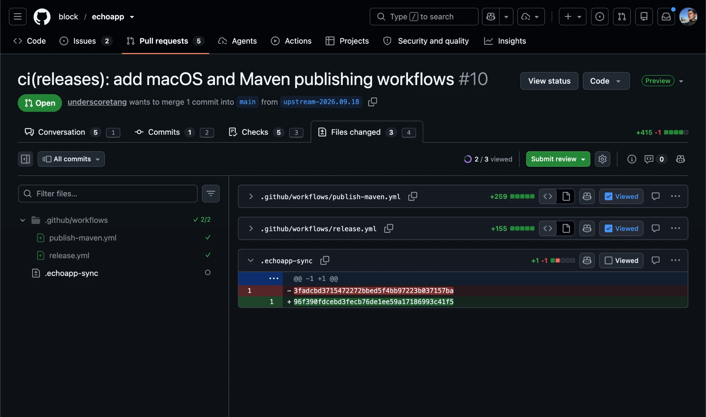

# My Better GitHub

A small Chrome extension that makes reviewing pull requests on GitHub a little
faster:

- **Tab shortcuts.** Press `1`–`4` to jump between a PR's tabs.
- **Review progress in the file tree.** The **Files changed** tree shows which
  files you've marked as **Viewed**, and how many are left in each directory.

It has no settings, requests no extension permissions, and sends no data
anywhere. See [Privacy](#privacy).

## Features

### Tab shortcuts

On any pull request page:

| Key | Tab           |
|-----|---------------|
| `1` | Conversation  |
| `2` | Commits       |
| `3` | Checks        |
| `4` | Files changed |

- Each tab shows a small key badge with its number, so you don't need to
  remember them.
- Switching uses GitHub's own tab links, so the page doesn't fully reload.
- Shortcuts are ignored while you type in a comment box or other input, and
  when Ctrl, Cmd, or Alt is held, so they don't clash with browser or GitHub
  shortcuts.

### Viewed state in the file tree

On a PR's **Files changed** tab, the file tree on the left mirrors each file's
**Viewed** checkbox and updates as you toggle it:

| Row                          | Looks like                     |
|------------------------------|--------------------------------|
| File not viewed yet          | `○` on the right               |
| Viewed file                  | Dimmed, green `✓`              |
| Directory, partly viewed     | Count of viewed files, `3/9`   |
| Directory, fully viewed      | Dimmed, green `✓ 9/9`          |

Directory counts include every file under that directory, including files in
collapsed subdirectories and diffs GitHub hasn't loaded yet.

You need to be signed in to GitHub, since the **Viewed** checkbox only exists
for signed-in users.

## Install

The extension isn't in the Chrome Web Store. Load it from source:

1. Clone this repository, or download it as a ZIP and unzip it.
2. Open `chrome://extensions` in Chrome.
3. Turn on **Developer mode** (top right).
4. Click **Load unpacked** and select the repository folder.
5. Refresh any GitHub tabs that were already open.

It should also work in other Chromium-based browsers that support loading
unpacked extensions, such as Edge, Brave, and Arc. It's only tested in Chrome.

### Update

Pull the latest changes (or download them again), then click the reload icon
on the extension's card in `chrome://extensions` and refresh your GitHub tabs.

## Privacy

- The extension runs only on `https://github.com/*`.
- It requests no extension permissions and stores nothing.
- It makes no requests to any server other than GitHub. On the **Files
  changed** tab it may re-fetch the page you're on from github.com, to read
  which files are viewed after an in-page navigation.

## Limitations

The extension reads GitHub's page structure, which GitHub can change at any
time. If a feature stops working, GitHub most likely changed its markup.

- The file tree feature supports GitHub's current **Files changed** view
  (`/pull/<number>/changes`). It doesn't support GitHub's older, classic
  files view.

## Development

There is no build step. The extension is plain JavaScript and CSS:

| File                | Purpose                                            |
|---------------------|----------------------------------------------------|
| `manifest.json`     | Extension manifest (Manifest V3).                  |
| `content.js`        | Tab shortcuts, and tags tabs for their key badges. |
| `tab-shortcuts.css` | Styles for the key badges on the tabs.             |
| `viewed-tree.js`    | Tracks viewed state and tags file tree rows.       |
| `viewed-tree.css`   | Styles for the tagged file tree rows.              |

After you edit a file, click the reload icon on the extension's card in
`chrome://extensions`, then refresh any open GitHub tabs.

Both content scripts run on all of `github.com`, not just PR URLs. GitHub
navigates between pages without full reloads, so a script limited to PR URLs
wouldn't load if you arrived at a PR from another GitHub page.

## License

[MIT](LICENSE)
